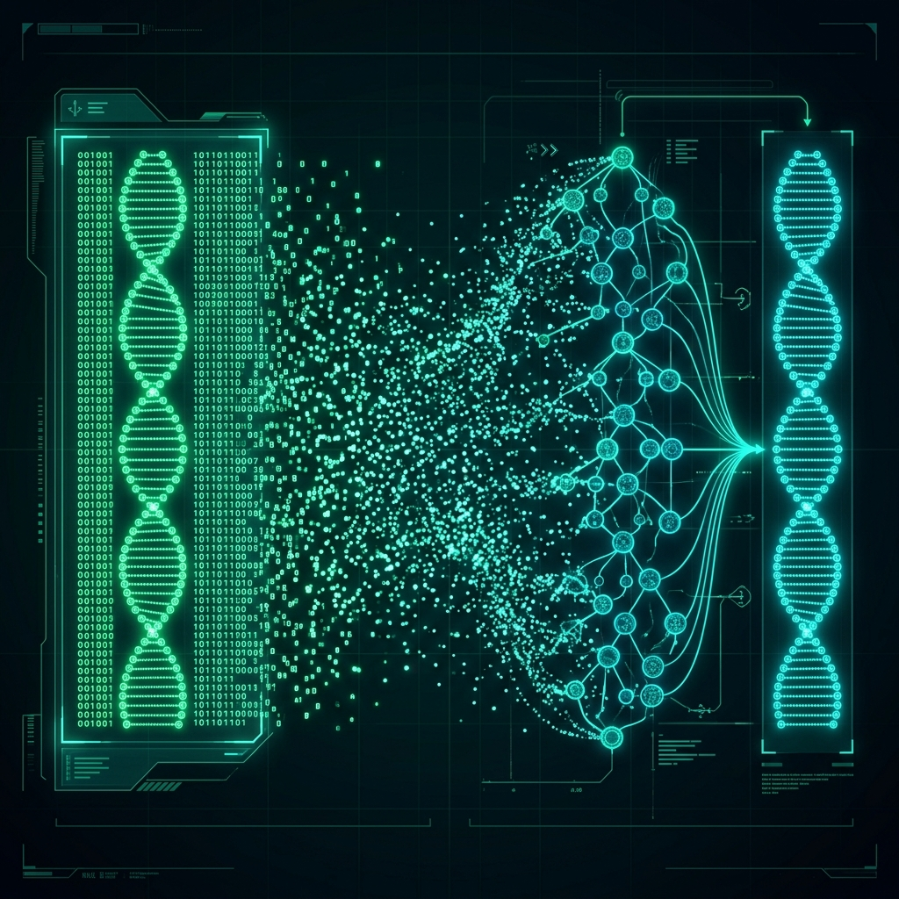

# Ilustraciones para Diapositivas de Tesis

Aquí tienes las representaciones visuales generadas por IA que puedes usar en tu sustentación para explicar la matemática detrás de los modelos.

### Arquitectura CTGAN (Redes Adversariales)
Representa el juego de suma cero entre el Generador y el Discriminador procesando estructuras de ADN y matrices de datos.

### Arquitectura Forest Diffusion (Difusión Tabular)
Representa el proceso en 3 fases: la matriz limpia disolviéndose en ruido estocástico (Gaussian noise) y siendo reconstruida matemáticamente por la red de Árboles de Decisión (Random Forests).

