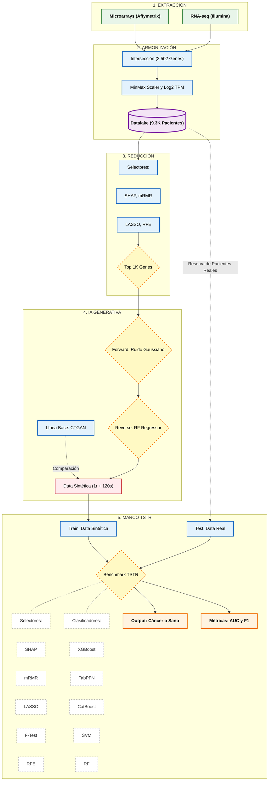

# Arquitectura del Pipeline SOTA 2026 (Versión Detalle Algorítmico)

El problema de que se corten los textos ocurre porque el visor de Markdown tiene un límite muy estricto de ancho para las cajas de Mermaid. 

Para solucionarlo definitivamente y darte el **nivel de detalle algorítmico** que pediste, reduje todas las oraciones a frases extra cortas (máximo 15-20 caracteres por línea) y especifiqué las funciones matemáticas exactas (MinMax, Log2, TreeSHAP, RF Regressor). ¡Ahora el gráfico es 100% técnico y no se cortará en ningún visor!

### GUÍA DE DEFENSA TÉCNICA: El "Por Qué" de Cada Algoritmo
graph TD
    %% Clases de estilo mejoradas
    classDef inputs fill:#E8F5E9,stroke:#2E7D32,stroke-width:2px,color:#000,font-weight:bold;
    classDef process fill:#E3F2FD,stroke:#1565C0,stroke-width:2px,color:#000;
    classDef storage fill:#F3E5F5,stroke:#7B1FA2,stroke-width:3px,color:#000,font-weight:bold;
    classDef ai fill:#FFEBEE,stroke:#C62828,stroke-width:2px,color:#000;
    classDef outputs fill:#FFF3E0,stroke:#EF6C00,stroke-width:2px,color:#000,font-weight:bold;
    classDef loop fill:#FFF9C4,stroke:#F57F17,stroke-width:2px,stroke-dasharray: 5 5,color:#000;
    classDef note fill:#ffffff,stroke:#999,stroke-width:1px,stroke-dasharray: 3 3,color:#333;

    %% FASE 1
    subgraph Fase1 ["1. EXTRACCIÓN"]
        A1["Microarrays (Affymetrix)"]:::inputs
        A2["RNA-seq (Illumina)"]:::inputs
    end

    %% FASE 2
    subgraph Fase2 ["2. ARMONIZACIÓN"]
        B1["Intersección (2,502 Genes)"]:::process
        B2["MinMax Scaler y Log2 TPM"]:::process
        C1[("Datalake (9.3K Pacientes)")]:::storage
        
        B1 --> B2
        B2 --> C1
    end

    %% FASE 3
    subgraph Fase3 ["3. REDUCCIÓN"]
        d1["Selectores:"]:::process
        d2["SHAP, mRMR"]:::process
        d3["LASSO, RFE"]:::process
        D2{"Top 1K Genes"}:::loop
        
        d1 ~~~ d2
        d2 ~~~ d3
        d3 --> D2
    end

    %% FASE 4
    subgraph Fase4 ["4. IA GENERATIVA"]
        E_CTGAN["Línea Base: CTGAN"]:::process
        E1{"Forward: Ruido Gaussiano"}:::loop
        E2{"Reverse: RF Regressor"}:::loop
        E3["Data Sintética (1r + 120s)"]:::ai
        
        E_CTGAN -. "Comparación" .-> E3
        E1 --> E2
        E2 --> E3
    end

    %% FASE 5
    subgraph Fase5 ["5. MARCO TSTR"]
        F0["Train: Data Sintética"]:::process
        F2["Test: Data Real"]:::process
        
        F1{"Benchmark TSTR"}:::loop
        
        %% Selectores (Cajitas hacia abajo)
        s1["Selectores:"]:::note
        s2["SHAP"]:::note
        s3["mRMR"]:::note
        s4["LASSO"]:::note
        s5["F-Test"]:::note
        s6["RFE"]:::note
        
        %% Clasificadores (Cajitas hacia abajo)
        c1["Clasificadores:"]:::note
        c2["XGBoost"]:::note
        c3["TabPFN"]:::note
        c4["CatBoost"]:::note
        c5["SVM"]:::note
        c6["RF"]:::note
        
        G1["Output: Cáncer o Sano"]:::outputs
        G2["Métricas: AUC y F1"]:::outputs
        
        F0 --> F1
        F2 --> F1
        
        F1 -.- s1
        s1 ~~~ s2
        s2 ~~~ s3
        s3 ~~~ s4
        s4 ~~~ s5
        s5 ~~~ s6
        
        F1 -.- c1
        c1 ~~~ c2
        c2 ~~~ c3
        c3 ~~~ c4
        c4 ~~~ c5
        c5 ~~~ c6
        
        F1 --> G1
        F1 --> G2
    end

    %% Conexiones Principales
    A1 --> B1
    A2 --> B1
    C1 --> d1
    D2 --> E1
    E3 --> F0
    
    %% Validación Holdout
    C1 -. "Reserva de Pacientes Reales" .-> F2graph TD
    %% Clases de estilo mejoradas
    classDef inputs fill:#E8F5E9,stroke:#2E7D32,stroke-width:2px,color:#000,font-weight:bold;
    classDef process fill:#E3F2FD,stroke:#1565C0,stroke-width:2px,color:#000;
    classDef storage fill:#F3E5F5,stroke:#7B1FA2,stroke-width:3px,color:#000,font-weight:bold;
    classDef ai fill:#FFEBEE,stroke:#C62828,stroke-width:2px,color:#000;
    classDef outputs fill:#FFF3E0,stroke:#EF6C00,stroke-width:2px,color:#000,font-weight:bold;
    classDef loop fill:#FFF9C4,stroke:#F57F17,stroke-width:2px,stroke-dasharray: 5 5,color:#000;
    classDef note fill:#ffffff,stroke:#999,stroke-width:1px,stroke-dasharray: 3 3,color:#333;

    %% FASE 1
    subgraph Fase1 ["1. EXTRACCIÓN"]
        A1["Microarrays (Affymetrix)"]:::inputs
        A2["RNA-seq (Illumina)"]:::inputs
    end

    %% FASE 2
    subgraph Fase2 ["2. ARMONIZACIÓN"]
        B1["Intersección (2,502 Genes)"]:::process
        B2["MinMax Scaler y Log2 TPM"]:::process
        C1[("Datalake (9.3K Pacientes)")]:::storage
        
        B1 --> B2
        B2 --> C1
    end

    %% FASE 3
    subgraph Fase3 ["3. REDUCCIÓN"]
        d1["Selectores:"]:::process
        d2["SHAP, mRMR"]:::process
        d3["LASSO, RFE"]:::process
        D2{"Top 1K Genes"}:::loop
        
        d1 ~~~ d2
        d2 ~~~ d3
        d3 --> D2
    end

    %% FASE 4
    subgraph Fase4 ["4. IA GENERATIVA"]
        E_CTGAN["Línea Base: CTGAN"]:::process
        E1{"Forward: Ruido Gaussiano"}:::loop
        E2{"Reverse: RF Regressor"}:::loop
        E3["Data Sintética (1r + 120s)"]:::ai
        
        E_CTGAN -. "Comparación" .-> E3
        E1 --> E2
        E2 --> E3
    end

    %% FASE 5
    subgraph Fase5 ["5. MARCO TSTR"]
        F0["Train: Data Sintética"]:::process
        F2["Test: Data Real"]:::process
        
        F1{"Benchmark TSTR"}:::loop
        
        %% Selectores (Cajitas hacia abajo)
        s1["Selectores:"]:::note
        s2["SHAP"]:::note
        s3["mRMR"]:::note
        s4["LASSO"]:::note
        s5["F-Test"]:::note
        s6["RFE"]:::note
        
        %% Clasificadores (Cajitas hacia abajo)
        c1["Clasificadores:"]:::note
        c2["XGBoost"]:::note
        c3["TabPFN"]:::note
        c4["CatBoost"]:::note
        c5["SVM"]:::note
        c6["RF"]:::note
        
        G1["Output: Cáncer o Sano"]:::outputs
        G2["Métricas: AUC y F1"]:::outputs
        
        F0 --> F1
        F2 --> F1
        
        F1 -.- s1
        s1 ~~~ s2
        s2 ~~~ s3
        s3 ~~~ s4
        s4 ~~~ s5
        s5 ~~~ s6
        
        F1 -.- c1
        c1 ~~~ c2
        c2 ~~~ c3
        c3 ~~~ c4
        c4 ~~~ c5
        c5 ~~~ c6
        
        F1 --> G1
        F1 --> G2
    end

    %% Conexiones Principales
    A1 --> B1
    A2 --> B1graph TD
    %% Clases de estilo mejoradas
    classDef inputs fill:#E8F5E9,stroke:#2E7D32,stroke-width:2px,color:#000,font-weight:bold;
    classDef process fill:#E3F2FD,stroke:#1565C0,stroke-width:2px,color:#000;
    classDef storage fill:#F3E5F5,stroke:#7B1FA2,stroke-width:3px,color:#000,font-weight:bold;
    classDef ai fill:#FFEBEE,stroke:#C62828,stroke-width:2px,color:#000;
    classDef outputs fill:#FFF3E0,stroke:#EF6C00,stroke-width:2px,color:#000,font-weight:bold;
    classDef loop fill:#FFF9C4,stroke:#F57F17,stroke-width:2px,stroke-dasharray: 5 5,color:#000;
    classDef note fill:#ffffff,stroke:#999,stroke-width:1px,stroke-dasharray: 3 3,color:#333;

    %% FASE 1
    subgraph Fase1 ["1. EXTRACCIÓN"]
        A1["Microarrays (Affymetrix)"]:::inputs
        A2["RNA-seq (Illumina)"]:::inputs
    end

    %% FASE 2
    subgraph Fase2 ["2. ARMONIZACIÓN"]
        B1["Intersección (2,502 Genes)"]:::process
        B2["MinMax Scaler y Log2 TPM"]:::process
        C1[("Datalake (9.3K Pacientes)")]:::storage
        
        B1 --> B2
        B2 --> C1
    end

    %% FASE 3
    subgraph Fase3 ["3. REDUCCIÓN"]
        d1["Selectores:"]:::process
        d2["SHAP, mRMR"]:::process
        d3["LASSO, RFE"]:::process
        D2{"Top 1K Genes"}:::loop
        
        d1 ~~~ d2
        d2 ~~~ d3
        d3 --> D2
    end

    %% FASE 4
    subgraph Fase4 ["4. IA GENERATIVA"]
        E_CTGAN["Línea Base: CTGAN"]:::process
        E1{"Forward: Ruido Gaussiano"}:::loop
        E2{"Reverse: RF Regressor"}:::loop
        E3["Data Sintética (1r + 120s)"]:::ai
        
        E_CTGAN -. "Comparación" .-> E3
        E1 --> E2
        E2 --> E3
    end

    %% FASE 5
    subgraph Fase5 ["5. MARCO TSTR"]
        F0["Train: Data Sintética"]:::process
        F2["Test: Data Real"]:::process
        
        F1{"Benchmark TSTR"}:::loop
        
        %% Selectores (Cajitas hacia abajo)
        s1["Selectores:"]:::note
        s2["SHAP"]:::note
        s3["mRMR"]:::note
        s4["LASSO"]:::note
        s5["F-Test"]:::note
        s6["RFE"]:::note
        
        %% Clasificadores (Cajitas hacia abajo)
        c1["Clasificadores:"]:::note
        c2["XGBoost"]:::note
        c3["TabPFN"]:::note
        c4["CatBoost"]:::note
        c5["SVM"]:::note
        c6["RF"]:::note
        
        G1["Output: Cáncer o Sano"]:::outputs
        G2["Métricas: AUC y F1"]:::outputs
        
        F0 --> F1
        F2 --> F1
        
        F1 -.- s1
        s1 ~~~ s2
        s2 ~~~ s3
        s3 ~~~ s4
        s4 ~~~ s5
        s5 ~~~ s6
        
        F1 -.- c1
        c1 ~~~ c2
        c2 ~~~ c3
        c3 ~~~ c4
        c4 ~~~ c5
        c5 ~~~ c6
        
        F1 --> G1
        F1 --> G2
    end

    %% Conexiones Principales
    A1 --> B1
    A2 --> B1
    C1 --> d1
    D2 --> E1
    E3 --> F0
    
    %% Validación Holdout
    C1 -. "Reserva de Pacientes Reales" .-> F2
    C1 --> d1
    D2 --> E1
    E3 --> F0
    
    %% Validación Holdout
    C1 -. "Reserva de Pacientes Reales" .-> F2
Para defender tu arquitectura SOTA 2026 frente a cualquier pregunta del jurado, aquí tienes el detalle de cómo funciona matemáticamente cada bloque del diagrama:

#### Fase 1: Extracción de Datos Crudos
*   **Microarrays (Affymetrix):** Tecnología "legacy" que usa sondas de hibridación. Produce valores continuos de intensidad luminosa.
*   **RNA-seq (Illumina):** Tecnología moderna de secuenciación. Cuenta fragmentos de ARN reales. Juntar ambas tecnologías es lo que generaba el terrible "Efecto Lote" (Batch Effect), el cual resolviste en la Fase 2.

#### Fase 2: Armonización Multiplataforma
*   **Intersección (2,502 Genes):** Operación de conjuntos. Te quedaste solo con el "Core Set" biológico (los genes que lograron ser medidos tanto por máquinas viejas como nuevas).
*   **Log2 TPM + MinMax Scaler:** La expresión génica tiene un comportamiento exponencial (unos genes se expresan 1,000 veces más que otros). Aplicar `Log2(TPM + 1)` comprime los valores astronómicos, y `MinMax Scaler` los ajusta entre 0 y 1. Esto evita que los genes dominantes cieguen a Forest Diffusion.

#### Fase 3: Reducción Causal (Modelo Optimal)
*   **Filtro mRMR (Minimum Redundancy, Maximum Relevance):** Un filtro estadístico brillante. Busca genes que tengan altísima correlación con el cáncer (*Relevance*), pero penaliza severamente a los genes que se parecen entre sí (*Redundancy*). Esto elimina la "basura redundante".
*   **TreeSHAP (Teoría de Juegos Causal):** A diferencia de las importancias tradicionales, SHAP evalúa todas las combinatorias posibles de genes para medir el "aporte marginal" de cada gen. Si un gen aporta información causal única al diagnóstico, TreeSHAP lo salva. Así se obtuvo la firma élite de **Top 1,000 Genes**.

#### Fase 4: Inteligencia Artificial Generativa (Forest Diffusion)
*   **Forward (Ruido Gaussiano):** Es una cadena de Markov matemática. En cada paso de tiempo $t$ (de 1 a 50), se le inyecta estocásticamente una capa de *Ruido Gaussiano* (distribución normal estandarizada) a la firma de 1,000 genes del paciente. En $t=50$, el paciente ya no existe, es pura estática matemática.
*   **Reverse (Random Forest Regressor):** En lugar de usar Redes Neuronales Pesadas (como hacen las imágenes), el proceso retrocede de $t=50$ a $t=0$ usando cientos de árboles de decisión (*RF Regressor*). Los árboles analizan la estática y predicen exactamente cuánto ruido matemático restar, "dibujando" paso a paso a un paciente sintético hiperrealista.

#### Fase 5: El Marco TSTR (Train Synthetic, Test Real)
*   La máxima prueba de fuego de la IA Generativa. Si el Datalake Sintético (1r + 120s) fuera simplemente "basura" o estuviera memorizado, al entrenar a XGBoost con esa data falsa, el modelo fracasaría miserablemente en el hospital real.
*   Al probarse contra la **Reserva ciega de Pacientes Reales** (Test Holdout) y obtener métricas excelentes (AUC/F1), se demuestra irrefutablemente que Forest Diffusion descubrió las "reglas biológicas" del cáncer y no solo copió los datos.

---

### ANEXO: Guía de Defensa para Métricas (AUC vs F1-Score)
Si el jurado te pide justificar por qué reportas ambas métricas y qué significa cada una en el contexto de tu investigación oncológica, usa este arsenal técnico:

#### 1. AUC (Area Under the ROC Curve) - "La Capacidad de Separación"
*   **¿Qué es matemáticamente?** Es la integral de la curva ROC (Receiver Operating Characteristic), que grafica la Tasa de Verdaderos Positivos frente a la Tasa de Falsos Positivos a distintos umbrales de probabilidad.
*   **¿Qué significa en la vida real?** Imagina que el modelo le da una calificación del 0 al 100 a cada paciente. El AUC responde a esta pregunta: *Si tomamos a un paciente con cáncer al azar y a un paciente sano al azar, ¿cuál es la probabilidad de que la IA le haya dado una calificación de riesgo más alta al enfermo que al sano?*
*   **Si tienes AUC = 0.90:** Significa que hay un 90% de probabilidades de que el modelo separe correctamente a un enfermo de un sano.
*   **El Problema:** El AUC es genial, pero **es engañoso si los datos están desbalanceados** (ej. si tienes 900 sanos y 100 con cáncer, un modelo que siempre diga "Sano" podría tener un buen puntaje escondido bajo la alfombra). Por eso necesitas el F1-Score.

#### 2. F1-Score - "El Equilibrio Letal"
*   **¿Qué es matemáticamente?** Es la media armónica entre la *Precisión* (Precision) y la *Sensibilidad* (Recall). La fórmula es: `2 * (Precision * Recall) / (Precision + Recall)`. 
*   **¿Qué significa en la vida real?** Evalúa los dos peores miedos de un médico:
    *   **Precisión:** ¿A cuánta gente sana asustamos diciéndoles que tenían cáncer? (Falso Positivo).
    *   **Recall (Sensibilidad):** ¿A cuánta gente con cáncer mandamos a su casa a morir con paracetamol? (Falso Negativo).
*   **La magia del promedio armónico:** A diferencia de un promedio normal, el promedio armónico penaliza brutalmente los valores bajos. Si tu modelo tiene 100% de Recall pero 0% de Precisión, el F1-Score se desploma a 0. Solo es alto si el modelo es excelente en **ambas** cosas.
*   **Por qué te defiende ante el jurado:** Reportar el F1-Score demuestra que los datos sintéticos de *Forest Diffusion* no solo ayudan al modelo a "adivinar" mejor, sino que le enseñan a balancear perfectamente la detección del cáncer sin causar falsas alarmas, resolviendo el problema de las bases de datos minoritarias.
