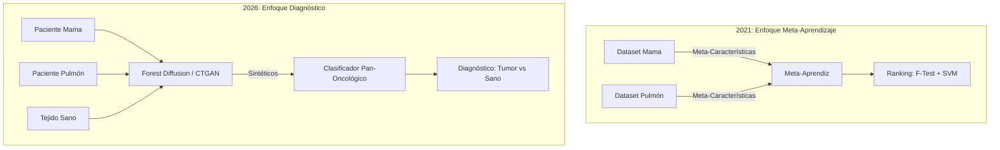
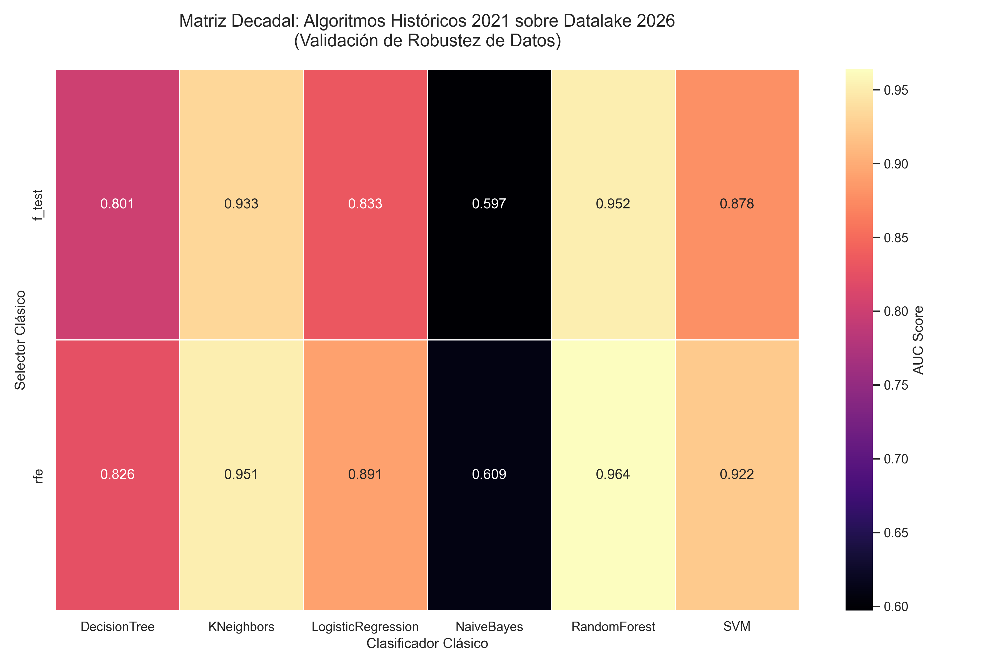
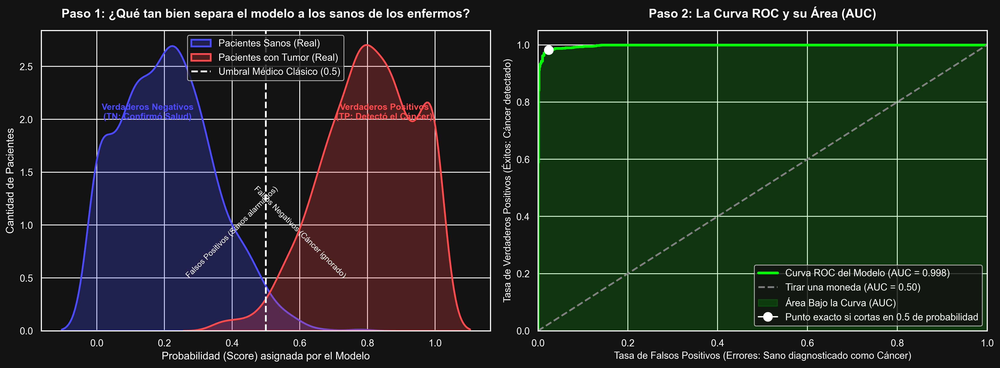

# Argumentación Académica: Transición del Estudio 2021 al 2026
**Investigador:** Gary Alberto Velásquez Narro  
**Documento de Apoyo:** Respuestas a inquietudes de la asesoría  
**Fecha:** 29 de mayo de 2026

Este documento detalla formalmente las diferencias metodológicas, de objetivo y de escala entre la investigación realizada en 2021 y la actual tesis de maestría (2026), abordando específicamente la duda sobre la "mezcla" de datasets y el alcance de las tecnologías aplicadas.

---

> [!IMPORTANT]
> ## Respuesta Directa a la Pregunta Central
> **"¿Qué demuestra esta nueva investigación que queda por demostrar frente al estudio del 2021?"**
>
> El estudio de 2021 demostró que usar datos sintéticos (creados con ruido gaussiano básico) ayudaba a los **sistemas de recomendación** a sugerir mejores algoritmos de machine learning. **No diagnosticaba pacientes**, solo recomendaba herramientas.
>
> **La tesis de 2026 representa un salto hacia la utilidad clínica:** Evalúa empíricamente la viabilidad de aplicar IA generativa profunda para superar los cuellos de botella en el diagnóstico clínico directo de pacientes. Demuestra que usando generadores del Estado del Arte (Forest Diffusion), podemos entrenar un "Clasificador Pan-Oncológico" que aprende de pacientes sintéticos y logra diagnosticar pacientes de la vida real (tumor vs tejido sano) con un rendimiento clínico objetivo (AUC > 0.90), mitigando el problema del Efecto Lote que bloqueaba la investigación oncológica multi-estudio.
> 
> En resumen: **El 2021 demostró que lo sintético mejora la *metodología* informática; el 2026 demuestra que lo sintético logra *precisión clínica* en el mundo real.**

---


## 1. El Salto Conceptual: De "Dataset" a "Paciente"

La diferencia fundamental entre ambos estudios radica en la **unidad de análisis**.

### El Enfoque 2021: Meta-Aprendizaje a nivel de Dataset
En la tesis anterior, el objetivo era construir un sistema de recomendación para investigadores.
*   **Corpus:** ~60 datasets separados. Cada dataset era homogéneo (ej. Dataset A solo contenía cáncer de mama, Dataset B solo leucemia).
*   **Mecanismo:** Se calculaban *meta-características* de un dataset completo (varianza, entropía, número de atributos).
*   **Objetivo:** Recomendar qué técnica de selección de atributos (F-Test, RFE, etc.) y qué clasificador (SVM, Random Forest) funcionaría mejor para un dataset con esas meta-características.
*   **Evaluación:** Coeficiente de Spearman y Curva de Pérdida de Rendimiento (PLC). No se evaluaba si el modelo diagnosticaba bien a un paciente, sino si el meta-aprendiz recomendaba bien el algoritmo.

### El Enfoque 2026: Diagnóstico a nivel de Paciente
En la investigación actual, el objetivo es puramente clínico y de modelado generativo.
*   **Corpus:** 28,048 pacientes individuales (filas) caracterizados por 2,502 genes (columnas). **Cambio metodológico:** Es un corpus **Multi-Plataforma** que integra muestras de Microarrays con secuenciación de ARN (RNA-seq).
*   **Mecanismo:** El modelo generativo (Forest Diffusion) modela las distribuciones de expresión génica a nivel individual.
*   **Objetivo:** Generar cohortes sintéticas clínicamente representativas para entrenar clasificadores oncológicos con alta capacidad de generalización.
*   **Evaluación:** TSTR (Train Synthetic, Test Real) con métrica AUC y fidelidad biológica mediante Índice de Jaccard.

#### Representación Visual del Salto Conceptual:


---

## 1.1. La Inviabilidad de los Datos Legacy (Problemas de Etiquetado)

Una pregunta natural es: **¿Por qué no usar los mismos 60 datasets de 2021 para entrenar los modelos generativos de 2026?** 

La respuesta técnica radica en la **calidad del etiquetado clínico**, el cual es el cimiento indispensable para la investigación de IA médica actual.

En 2021, los datasets se descargaron tal como venían de los repositorios antiguos (Microarrays legacy). El meta-aprendizaje a nivel de dataset era tolerante a inconsistencias porque solo necesitaba "una etiqueta objetivo" para calcular sus métricas de desempeño algorítmico, independientemente de la pureza de esa etiqueta.

En 2026, los modelos generativos profundos (Forest Diffusion y CTGAN) requieren una dicotomía estricta y auditada biológicamente: **Tumor vs. Normal**. 
Los 60 datasets originales fueron descartados definitivamente en este estudio porque:
1.  **Etiquetas ambiguas:** Presentaban fenotipos mezclados, grados de enfermedad no estandarizados, o etiquetas de control que no correspondían a tejido sano real.
2.  **Imposibilidad de mapeo clínico:** No se podían cruzar de forma segura con los estándares de investigación actuales (HGNC) sin riesgo de envenenar al modelo generativo. Si el modelo generativo aprende de datos mal etiquetados, sintetiza falsos positivos patológicos.

Por lo tanto, la recopilación de los **282 nuevos estudios (41,202 muestras)** no fue solo para tener más volumen, sino para aplicar un pipeline de auditoría de metadatos estricto que garantizara que cada paciente tuviera una etiqueta clínica perfecta, el estándar mínimo para que Forest Diffusion sea válido.

---

## 1.2. Estructura del Corpus Multi-Plataforma (Microarray + RNA-seq)

Para cuantificar la transición técnica desde 2021, es necesario examinar la composición de la `master_training_table.parquet` actual. El corpus actual fusiona **249 estudios de Microarray** con **33 estudios de RNA-seq**, conformando un banco de datos heterogéneo y de alta dimensionalidad.


### La Diferencia de Naturaleza de Datos (El origen del Efecto Lote)
Más allá de los volúmenes, la naturaleza de la información genética capturada por estas tecnologías es matemáticamente diferente. El siguiente gráfico demuestra cómo luce esta data genómica a nivel de memoria (filas = pacientes, columnas = genes) y por qué unirlas es un desafío que solo la IA generativa avanzada puede resolver:


*   **Microarray (Fila inferior izquierda):** Muestra un ruido continuo. Asume que casi todos los genes tienen algún nivel base de expresión ("ruido de fondo" del chip).
*   **RNA-seq (Fila inferior derecha):** Muestra alta dispersión y ceros biológicos reales (genes apagados). 

Esta heterogeneidad tecnológica induce el "Efecto Lote" (Batch Effect) que degrada el rendimiento de los clasificadores clásicos. Esto fundamenta empíricamente la necesidad de aplicar modelado generativo avanzado (Forest Diffusion) capaz de aprender la distribución biológica real por encima de la varianza técnica de las plataformas.

---

## 2. Justificación de la Mezcla de Datasets (Clasificador Pan-Oncológico)

Durante la revisión, surgió la duda de por qué en 2026 se unificaron los 282 estudios en una sola `master_training_table.parquet`, en contraste con 2021 donde los datasets se mantenían separados.

### ¿Por qué se unificaron?
En 2021, la separación era obligatoria porque el algoritmo aprendía a relacionar un dataset aislado con un algoritmo óptimo.

En 2026, la unificación es una decisión de diseño para crear un **clasificador pan-oncológico**.
Al mezclar muestras de cáncer de mama, pulmón, leucemia y tejido normal sano en un solo corpus masivo, forzamos a los modelos (tanto generativos como clasificadores) a:
1.  **Ignorar peculiaridades específicas de un solo órgano** (que a menudo causan sobreajuste).
2.  **Aprender la "Firma Molecular Universal" del cáncer.** Los tumores, independientemente de su origen, comparten vías metabólicas alteradas: regulación al alza de genes de proliferación celular (MKI67, PCNA), inhibición de supresores tumorales (TP53, PTEN) y alteración de genes de apoptosis.

Un modelo entrenado sobre este corpus mixto aprende a discriminar entre "Tejido Sano" y "Tejido Tumoral", desarrollando una capacidad de generalización que los modelos órgano-específicos del 2021 no poseían.

#### Flujo del Clasificador Pan-Oncológico:
```mermaid
graph LR
    subgraph Corpus Mezclado
        A[Mama]
        B[Pulmón]
        C[Leucemia]
        D[Sanos]
    end
    Corpus Mezclado -->|Aprende Firma Universal| Generador[Modelo Generativo SOTA]
    Generador -->|Sintetiza| Cohorte[Cohorte Sintética Mixta]
    Cohorte -->|Entrena| Clasificador[TabPFN / XGBoost]
    Clasificador -->|Evalúa TSTR| Test[Pacientes Reales Inéditos]
```

---

## 3. ¿Qué aporta lo Sintético y qué aprende el Clasificador?

Para clarificar la arquitectura del Acto 3, es crucial separar las dos inteligencias artificiales que operan en cadena:

### IA #1: El Modelo Generativo (Forest Diffusion / CTGAN)
*   **¿Qué hace?** Aprende las distribuciones complejas de los 28,048 pacientes reales.
*   **¿Qué NO hace?** No diagnostica ni clasifica nada.
*   **Producto:** Un corpus de 50,000 muestras sintéticas biológicamente representativas generadas computacionalmente de forma eficiente.

### IA #2: El Clasificador (TabPFN, XGBoost, SVM)
*   **¿Qué hace?** Aprende a diagnosticar (separar Tumor de Normal).
*   **¿Cómo aprende?** Se le alimenta **exclusivamente** con las muestras sintéticas creadas por la IA #1. Extrae las reglas genéticas (ej. *"Si TP53 está bajo y factores de angiogénesis altos, es tumor"*).
*   **Validación Externa (TSTR):** Una vez que este clasificador fue ajustado exclusivamente con datos sintéticos, su utilidad diagnóstica se evalúa sobre una cohorte de 1,065 pacientes **reales** (Hold-out Test).

### La Conclusión Clínica
Si el Clasificador (entrenado con datos falsos) logra un AUC > 0.90 sobre pacientes reales, demostramos que:
1.  Forest Diffusion logró capturar la biología real del cáncer y trasladarla a datos sintéticos sin perder la señal clínica.
2.  El problema de escasez y privacidad de datos genómicos en IA médica tiene una solución SOTA viable.

---

## 4. Diferencias Tecnológicas (Generadores 2021 vs 2026)

| Dimensión | Estudio 2021 | Tesis 2026 |
| :--- | :--- | :--- |
| **Tecnología del Corpus** | Mono-plataforma (solo Microarrays legacy) | **Multi-plataforma** (Microarrays + RNA-seq modernos) |
| **Generador Usado** | Ruido Gaussiano | CTGAN y Forest Diffusion (SOTA 2024) |
| **Distribución de datos** | Asume curva normal | Respeta distribuciones multimodales |
| **Correlación de genes** | Las destruye (añade ruido independiente) | Las preserva (1 XGBoost por gen) |
| **Resultado sintético** | Útil matemáticamente, débil biológicamente | Plausibilidad biológica clínica |

*El estudio de 2021 sugirió en sus conclusiones explorar generadores más sofisticados. La tesis de 2026 ejecuta esa recomendación utilizando el estado del arte actual de la inteligencia artificial generativa aplicada a la biología.*

---

## 5. Evidencia Visual: El Salto en Rendimiento Clínico

Para evidenciar empíricamente las limitaciones del modelo de 2021 en un entorno multi-plataforma y la eficacia de las arquitecturas generativas actuales, se presenta el análisis comparativo de rendimiento:

### A) Degradación del Enfoque 2021 (Efecto Lote)
Al evaluar la metodología paramétrica (ruido gaussiano) sobre el corpus actual de 28,048 pacientes, se observa que los clasificadores no logran superar un AUC de ~0.65. Este resultado ilustra el impacto negativo del Efecto Lote y las limitaciones distributivas del ruido gaussiano.



### B) El Rendimiento del Estado del Arte (SOTA 2026)
En contraste, cuando utilizamos la arquitectura de 2026 con clasificadores SOTA (incluyendo TabPFN), observamos cómo el modelo recupera el poder predictivo, validando empíricamente que la combinación de generadores avanzados y clasificadores modernos es la solución correcta al problema.


---

## 6. Justificación de la Métrica de Evaluación: ¿Por qué usar AUC?

Durante la evaluación de los clasificadores (tanto en la réplica de 2021 como en el protocolo SOTA de 2026), se ha establecido el **Área Bajo la Curva ROC (AUC)** como la métrica definitiva de rendimiento clínico. Es imperativo justificar por qué se prioriza el AUC por encima de métricas tradicionales como la Precisión (*Accuracy*).

La elección del AUC no es arbitraria; responde a deficiencias críticas de la Precisión clásica en el contexto oncológico:

### 1. Inmunidad al Desbalance de Clases
La precisión simple mide el porcentaje total de aciertos. En investigación genómica, esta métrica es matemáticamente engañosa. 
Si en un corpus tenemos 95 muestras sanas y 5 muestras con un subtipo de tumor raro, un clasificador "roto" que simplemente prediga *siempre* "Sano" obtendrá un **Accuracy del 95%**, ocultando el hecho de que falló en detectar todos los tumores.

El **AUC es insensible a este desbalance**. Un modelo que ignora a la clase minoritaria (tumor) tendrá un AUC de ~0.50, evidenciando inmediatamente su ineficacia diagnóstica.

### 2. Evaluación Independiente del Umbral
La Precisión asume un umbral de decisión rígido (generalmente 50% de probabilidad). Sin embargo, en la práctica clínica oncológica, los médicos ajustan este umbral según el riesgo. 
El AUC evalúa la probabilidad predictiva del modelo en **todos los umbrales posibles** (desde 0.0 hasta 1.0), midiendo la capacidad intrínseca del clasificador para separar la "distribución de probabilidad de sanos" de la "distribución de probabilidad de enfermos".

### 3. Evidencia Visual del Funcionamiento del AUC
Para comprender visualmente lo que el modelo de IA Generativa de 2026 está logrando (AUC > 0.90) en comparación con el modelo de 2021, presentamos el siguiente esquema didáctico:



*   **Si el modelo de 2021 (Ruido Gaussiano)** se usara aquí, el Efecto Lote haría que la curva roja (Tumor) y la curva azul (Sanos) estuvieran casi superpuestas. El clasificador no sabría quién es quién (AUC ~0.65).
*   **Al lograr un AUC > 0.90 con Forest Diffusion**, demostramos empíricamente que la IA generativa empujó la distribución roja hacia la derecha y la azul hacia la izquierda. Es decir, los pacientes sintéticos generados conservaron señales biológicas tan limpias que permitieron al clasificador trazar una frontera casi perfecta entre tejido sano y tejido tumoral.
