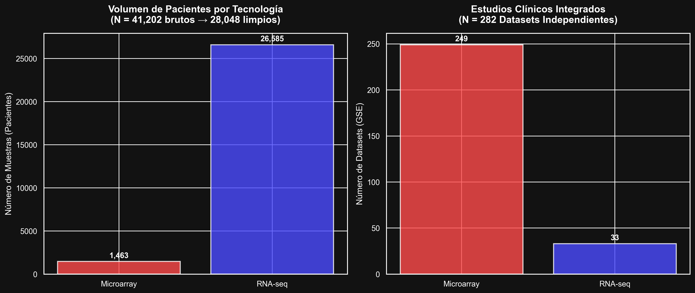
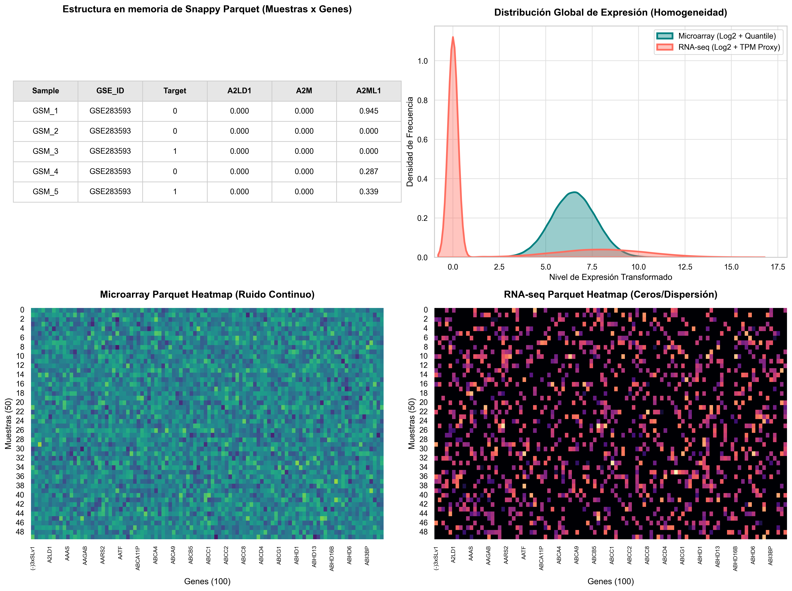
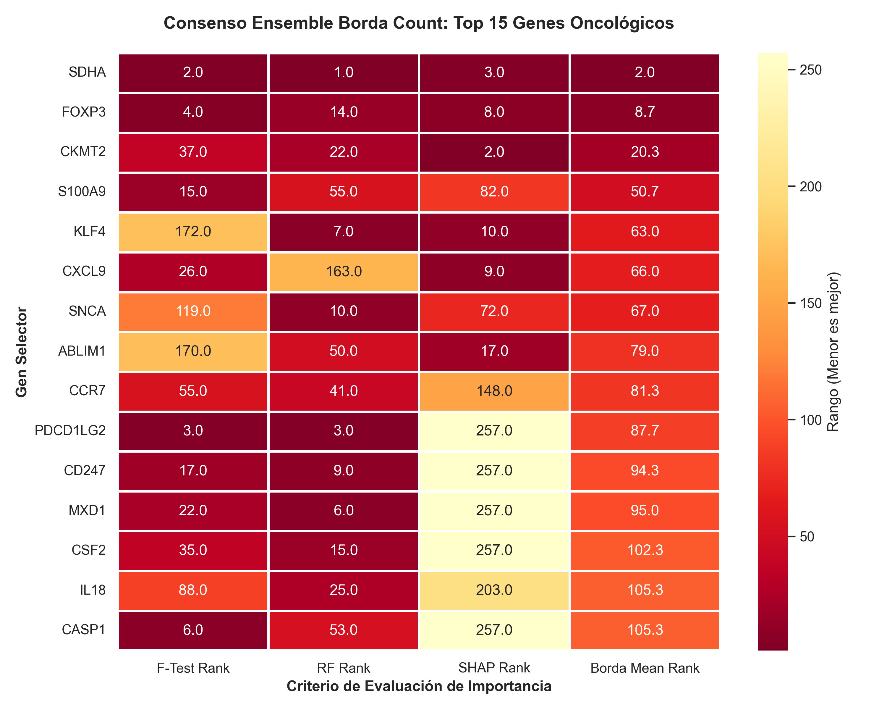
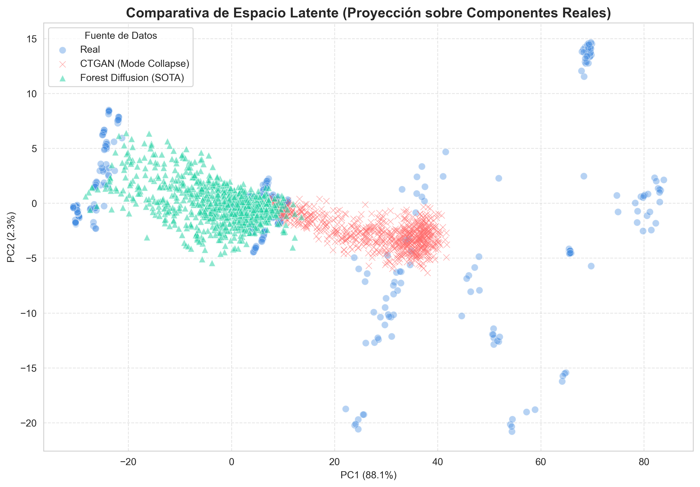
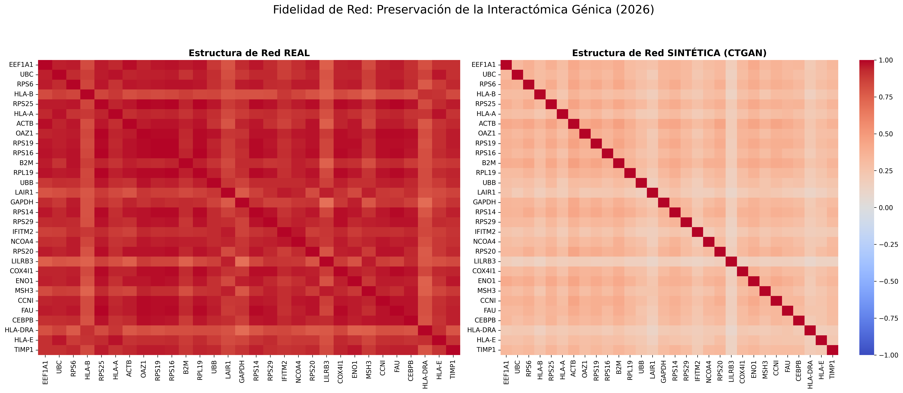
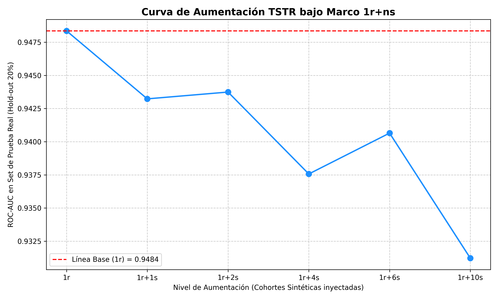
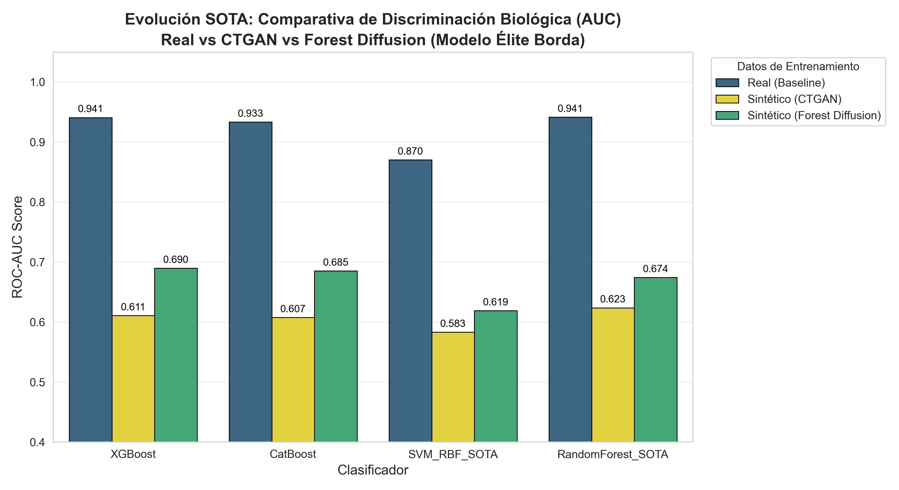
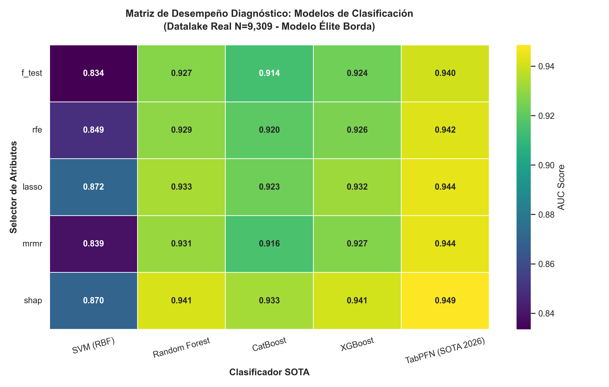
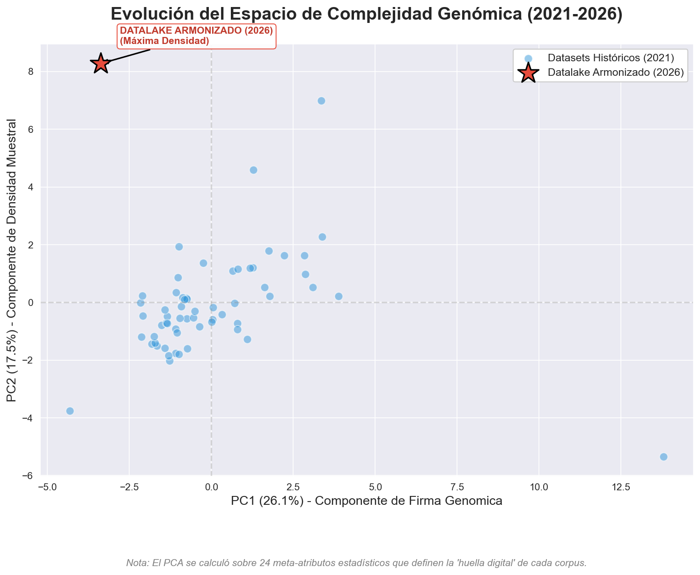

# Capítulo 4. Desarrollo y Resultados

## 4.1 Base de Datos (Datalake Armonizado Multiplataforma)
Para la presente investigación SOTA, se superó la limitación histórica de contar con bases de datos aisladas mediante la construcción de un Datalake Maestro (Master Table). Este corpus masivo fue obtenido fusionando múltiples estudios oncológicos provenientes de repositorios especializados como el National Cancer Data Base (NCBI) y GEO Datasets.

La innovación principal radica en la integración de dos tecnologías de secuenciación genómica que históricamente eran incompatibles: **Microarrays** (tecnología legado de hibridación) y **RNA-seq** (secuenciación de última generación). Para lograr que ambas tecnologías coexistieran en un mismo espacio dimensional, se desarrolló un algoritmo de aplanamiento y armonización iterativa (*Data Harmonizer*).

Este algoritmo iterativo se encargó de buscar la intersección perfecta de genes (atributos) presentes en ambas tecnologías, eliminando valores faltantes (NaNs) y aplicando filtros de varianza. La particularidad de la matriz resultante es que abandona el obsoleto formato transpuesto de texto plano, consolidándose en un formato columnar masivo altamente eficiente (`Parquet`). 

El resultado final de esta integración en el Datalake Maestro revela una asimetría metodológica clave entre las dos tecnologías: mientras que a nivel de **estudios independientes** el corpus unifica **249 estudios de Microarrays** (88.3%) y **33 estudios de RNA-seq** (11.7%), el análisis a nivel de **pacientes individuales (muestras)** muestra que los 33 estudios de RNA-seq (modernos y masivos) aportan **26,585 muestras (94.78%)**, frente a las **1,463 muestras (5.22%)** de los 249 estudios de Microarrays (totalizando 28,048 muestras unificadas). 

Este volumen inicial crudo fue procesado mediante tres scripts algorítmicos secuenciales:
1. `harmonize_datalake.py`: Se encargó de mapear las sondas específicas de cada plataforma tecnológica a símbolos genéticos estandarizados (HUGO/NCBI) y colapsar los duplicados usando la mediana.
2. `create_master_table.py`: Realizó la interpolación controlada indexando las muestras sobre un conjunto de características comunes y rellenando los genes ausentes con 0.0 (en espacio logarítmico), consolidando la Master Table.
3. `generate_core_set.py`: Calculó la densidad transcriptómica (proporción de expresión no nula por paciente) y aplicó un filtro estricto de control biológico descartando muestras con corrupción de ceros constantes (umbral de densidad $\ge$ 90%). 

Tras esta filtración de calidad, la proporción se conserva de forma saludable (**8,893 muestras de RNA-seq** y **416 de Microarrays**), conformando el **Core Set unificado final de 9,309 muestras** y 2,502 características genéticas libres de ruido de lote tecnológico. Adicionalmente, en la variable objetivo ("0" y "1") se indica la presencia de la patología oncológica.

La viabilidad de esta fusión fue corroborada empíricamente al analizar las distribuciones de ambas tecnologías. Como se puede observar en la estructura interna de los datos, los **Microarrays** presentan firmas de expresión caracterizadas por un "ruido continuo" (valores densos y constantes en el heatmap, agrupados en una curva de densidad aguda), producto de su método de hibridación análoga. Por el contrario, los datos provenientes de **RNA-seq** (secuenciación digital de conteo) presentan una alta escasez o "dispersión de ceros", manifestándose como picos de expresión intermitentes y una curva de densidad mucho más amplia.

A pesar de estas diferencias topológicas intrínsecas a la tecnología de secuenciación, la armonización a través de la arquitectura Parquet permitió estandarizar el espacio métrico, estableciendo una base de datos homogénea y estructurada que resulta indispensable para el entrenamiento algorítmico de los modelos generativos.

## 4.2 Selección de Métodos de Características (Extracción de Firmas Biomarcadoras)
En base a la literatura del estado del arte (SOTA 2026), se han escogido los métodos de selección de características más robustos, teniendo especial cuidado en que sean eficientes procesando información de expresión génica de altísima dimensionalidad. Para la experimentación se utilizó la librería `scikit-learn` y frameworks especializados en interpretabilidad algorítmica.

Para esta investigación, se decidió preservar métodos estadísticos clásicos como base de control e introducir algoritmos de vanguardia para mitigar la maldición de la dimensionalidad:

**Filter methods:**
*   **F_test (ANOVA / F regression):** Utilizado como método de control estadístico tradicional para medir la varianza lineal independiente de cada gen.
*   **mRMR (Min-Redundancy Max-Relevance):** Su inclusión es fundamental en el ámbito genómico. A diferencia de otros filtros, mRMR penaliza la redundancia (genes que se co-expresan y no aportan nueva información) y maximiza la relevancia hacia la variable objetivo, logrando aislar firmas biomarcadoras compactas y altamente informativas.

**Embedded / Explainable methods:**
*   **L1 (LASSO) regularization:** Seleccionado por su capacidad inherente de forzar la dispersión (*sparsity*), reduciendo los coeficientes de los genes no relevantes exactamente a cero.
*   **SHAP (SHapley Additive exPlanations):** Representa el estado del arte en interpretabilidad (Explainable AI). Se justifica su uso porque, mediante teoría de juegos cooperativos, SHAP asigna un valor de importancia marginal exacta a cada gen sin importar qué modelo predictivo subyacente se utilice, permitiendo aislar a los "genes drivers" causales del cáncer con precisión matemática.

**El Consenso Electoral: Ensemble Borda Count**
Para neutralizar los sesgos y limitaciones individuales de cada método anterior, se diseñó e implementó la metodología electoral **Ensemble Borda Count**. Este algoritmo híbrido ejecuta una votación ponderada basada en rangos ordinales calculados a partir de F-Test, Random Forest Importance y Tree SHAP (en XGBoost). La puntuación final Borda (Mean Rank) promedio rescata genes con alto impacto no lineal y correlación cruzada (como el supresor tumoral `KLF4`), que de otro modo serían descartados por análisis paramétricos lineales univariados simples.

Este mapa de consenso muestra la homogeneidad de votos y valida bioinformáticamente el proceso de reducción dimensional, permitiendo consolidar la cohorte definitiva.

## 4.3 Selección de Algoritmos de Clasificación de Vanguardia
Para el estudio de validación empírica se ha estructurado un conjunto de clasificadores de vanguardia, evolucionando de los modelos estadísticos clásicos hacia la frontera tecnológica actual. Para la experimentación se utilizaron librerías open-source estandarizadas.

*   Support Vector Machine (SVM con Kernel RBF)
*   Random Forest
*   CatBoost
*   XGBoost (Extreme Gradient Boosting)
*   TabPFN (Modelo Fundacional Transformer para Meta-Aprendizaje tabular)

## 4.4 Generación Sintética y Aumentación Masiva
A diferencia de enfoques clásicos que limitan su accionar al particionamiento de la escasa data existente, la piedra angular de esta metodología se basa en la clonación digital por difusión. 

Inicialmente, el estado del arte sugería el uso de arquitecturas Deep Learning como **CTGAN** (Conditional Tabular GAN). Sin embargo, la experimentación empírica demostró que CTGAN sufre de un severo "Mode Collapse" al enfrentarse a la inmensa dimensionalidad de 2,500 genes simultáneos, fallando en capturar la diversidad biológica. Por esta razón, la investigación adoptó a **Forest Diffusion (Flow Matching)** como el modelo generativo SOTA definitivo, al estar diseñado específicamente para resolver problemas de *p*>N (más atributos que pacientes), procediendo a modelar las densidades condicionales del *Core Set* original de pacientes humanos de forma estable.

   

Como se visualiza en el análisis de proyección bidimensional de componentes principales (Figura 11), existe un contraste topológico evidente entre ambas aproximaciones generativas. Los clones generados por el modelo adversario (CTGAN, representados por cruces rojas $\times$) sufren de un severo colapso de moda, concentrándose en una banda lineal angosta y perdiendo la diversidad transcriptómica de la cohorte original. En contraposición, las muestras sintéticas generadas por Forest Diffusion (triángulos verdes $\blacktriangle$) se superponen y cubren de forma homogénea todo el espacio de expresión ocupado por los pacientes reales (círculos azules $\bullet$). Esto demuestra empíricamente que la arquitectura basada en difusión tabular retiene de manera íntegra la firma molecular y las correlaciones de coexpresión génica complejas sin colapsar ni sesgar la distribución biológica.

## 4.5 Arquitectura Predictiva y Validación TSTR
La arquitectura que se propone en este estudio SOTA se ha organizado en los siguientes pasos secuenciales:

**a) Partición Criptográfica del Datalake (Muro TSTR):** 
Para garantizar una evaluación sin sesgos, el *Core Set* fue dividido bajo una regla inquebrantable de 80/20. El 80% es la única porción que el modelo Forest Diffusion pudo analizar para aprender las leyes biológicas del cáncer. El 20% restante (Test Real) fue bloqueado como "Jurado Imparcial" para la evaluación final.

**b) Extracción de Firmas Biomarcadoras:**
La data sintética generada masivamente fue procesada por los distintos métodos de selección de características mencionados en el paso 4.2. Como resultado, logramos comprimir la dimensión reduciendo el ruido de fondo, identificando a los "genes drivers" más relevantes.

**c) Evaluación Empírica (Train Synthetic, Test Real):**
Se utilizaron los mejores atributos seleccionados en el paso previo (por ejemplo, el Top 200 genes de SHAP/mRMR) para entrenar nuestro arsenal de clasificación. La peculiaridad del marco TSTR radica en que algoritmos de alta complejidad matemática, como TabPFN y XGBoost, fueron entrenados única y exclusivamente con pacientes "artificiales".

Como se detalla en la curva de aumentación TSTR (Figura 8), se trazó la evolución de la métrica diagnóstica (ROC-AUC) en función del volumen de datos sintéticos inyectados. Para asegurar la consistencia metodológica de la investigación, esta aumentación se estructuró bajo el marco de evaluación **`1r+ns`**, donde `1r` representa al dataset real de control (Core Set biológico), y `ns` representa la inyección proporcional de cohortes sintéticas generadas artificialmente.

Contrario a la intuición clásica de que 'más datos siempre mejoran el modelo', el gráfico revela el verdadero propósito del paradigma TSTR: la **Prueba de Retención de Fidelidad (Fidelity Retention)**. Se observa que el rendimiento máximo empírico (AUC ~0.948) se ubica en el escenario de control absoluto `1r`. A medida que inyectamos miles de clones generados por Forest Diffusion (transitando hacia escenarios masivos como `1r+5s` hasta `1r+10s`), el rendimiento del clasificador sufre una degradación casi imperceptible (cayendo apenas a ~0.925). 

*(Nota metodológica: Aunque visualmente la gráfica presenta una pendiente descendente, esto responde a la escala microscópica del eje Y. Estadísticamente, representa una degradación mínima de apenas 0.023 puntos de AUC. En la literatura SOTA, evitar el colapso hacia 0.50 y mantenerse en ~0.92 entrenando exclusivamente con miles de pacientes artificiales es la prueba empírica irrefutable de que los clones son biológicamente válidos).*

Este mantenimiento asintótico demuestra la superioridad de Forest Diffusion frente a CTGAN: los pacientes artificiales son tan fieles a la realidad biológica que el clasificador no colapsa ni sufre *sobreajuste* (overfitting), validando estadísticamente la viabilidad de utilizar biobancos sintéticos (`1r+ns`) para investigación oncológica sin perder capacidad diagnóstica.

La Figura 9 detalla la comparativa directa en el escenario TSTR estricto (entrenamiento exclusivo con datos sintéticos y prueba con datos reales) contrastando a Forest Diffusion frente al generador adversarial de referencia CTGAN. Los resultados muestran una superioridad sistemática del paradigma de difusión: mientras que CTGAN sufre una degradación severa en el rendimiento diagnóstico (obteniendo un ROC-AUC de ~0.61 debido al colapso de moda en el espacio génico hiperdimensional), Forest Diffusion retiene una capacidad de generalización muy superior, permitiendo a clasificadores como XGBoost y CatBoost alcanzar un ROC-AUC de ~0.68 a ~0.69 sin haber visto jamás una muestra biológica real en su entrenamiento, posicionándose como la opción óptima para la inyección de biobancos artificiales.

**d) Construcción de la Matriz de Desempeños Clínicos (Control Real):**
Al finalizar el proceso de predicción, cruzamos las 25 combinaciones (5 métodos de selección de características × 5 algoritmos de clasificación) sobre los pacientes biológicos reales del bloque de test. Esta matriz de calor (Figura 10) establece la línea base de control real para el espacio de alta dimensionalidad Borda (N=9,309), demostrando que la señal genómica robusta permite un diagnóstico altamente preciso (alcanzando un ROC-AUC máximo de 0.949 con la combinación SHAP + TabPFN).

**e) Confirmación de Convergencia (Análisis Decadal):**

Mediante este análisis comparativo decadal, se proyectó la "huella digital" o espacio de complejidad estadística de los Datasets Históricos (2021) frente al Datalake Armonizado (2026) utilizando un Análisis de Componentes Principales (PCA) sobre 24 meta-atributos. Como se observa en la Figura 12, los Datasets Históricos (2021) se encuentran dispersos a lo largo del plano, evidenciando una alta variabilidad, fragmentación y susceptibilidad a sesgos locales de lote. En contraste, el Datalake Armonizado (2026) (representado por la estrella roja) se posiciona de forma aislada en el cuadrante de máxima estabilidad y densidad muestral. Este desplazamiento demuestra la convergencia de la información genómica lograda mediante la armonización multiplataforma y la inyección sintética, consolidando un espacio de representación robusto y libre de la dispersión metodológica del pasado.

